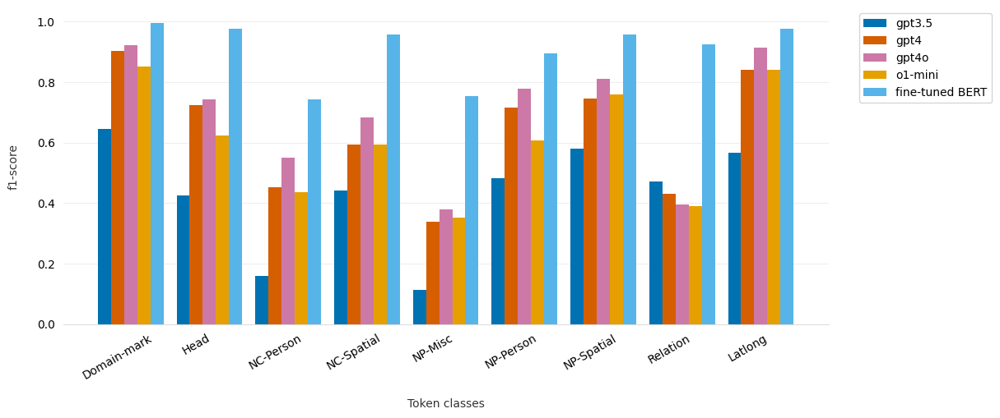

# Evaluating Named Entity Recognition using Few-Shot Prompting with Large Language Models


Code and ressources for evaluating Named Entity Recognition using Few-Shot Prompting with Large Language Models


To use GPT models you need an API key from [openai.com](https://platform.openai.com/api-keys). 
Then, make sure your API key is exported as an environmental variable:

```sh
export OPENAI_API_KEY="sk-..."
```


## Overview

The objective of this work is to evaluate the capabilities of LLMs on the NER task at the token and span (or entity) levels. 
For these two tasks, the output must be a JSON format with information for each detected token or span.

Our methodology relies on a prompt containing descriptions of the task, tagset and one example (with both input and output). 
A preliminary experiment reveals that LLMs struggle to accurately retrieve or calculate token or span positions from raw input text. 
Although the output format was correct, the generated position values were inaccurate, resembling hallucinations or random numbers rather than referring to actual token positions, despite appearing as numerical values.
To address this issue, we propose a solution that includes tokenization information—specifically, token position details for span detection—within the input data.

The experiments are performed using the [GeoEDdA dataset](https://huggingface.co/datasets/GEODE/GeoEDdA) which contains semantic annotations (at the token and span levels) for named entities (i.e., Spatial, Person, and Misc), nominal entities, spatial relations, and geographic coordinates. Nested named entities also present in this dataset were not considered in this experiment.

GPT models from the [OpenAI API](https://openai.com) (`gpt-3.5-turbo-0125`, `gpt-4-0613`, `gpt-4o-2024-05-13`, and `o1-mini-2024-09-12`) were evaluated through the LangChain Python framework. 
Jupyter notebooks for token and span levels are available in this repository.


## Token classification

### Running the experiments

* [token_classification_gpt.ipynb](https://github.com/GEODE-project/ner-llm/blob/main/token_classification_gpt.ipynb)


### Evaluation

* [token_classification_gpt_evaluation.ipynb](https://github.com/GEODE-project/ner-llm/blob/main/token_classification_gpt_evaluation.ipynb)

Micro average F1-scores (with a comparison with a [fine-tuned BERT](https://huggingface.co/GEODE/camembert-base-edda-span-classification) model):



## Span categorization

*come back later*


## Acknowledgements

The authors are grateful to the ASLAN project (ANR-10-LABX-0081) of the Université de Lyon, for its financial support within the French program "Investments for the Future" operated by the National Research Agency (ANR).


